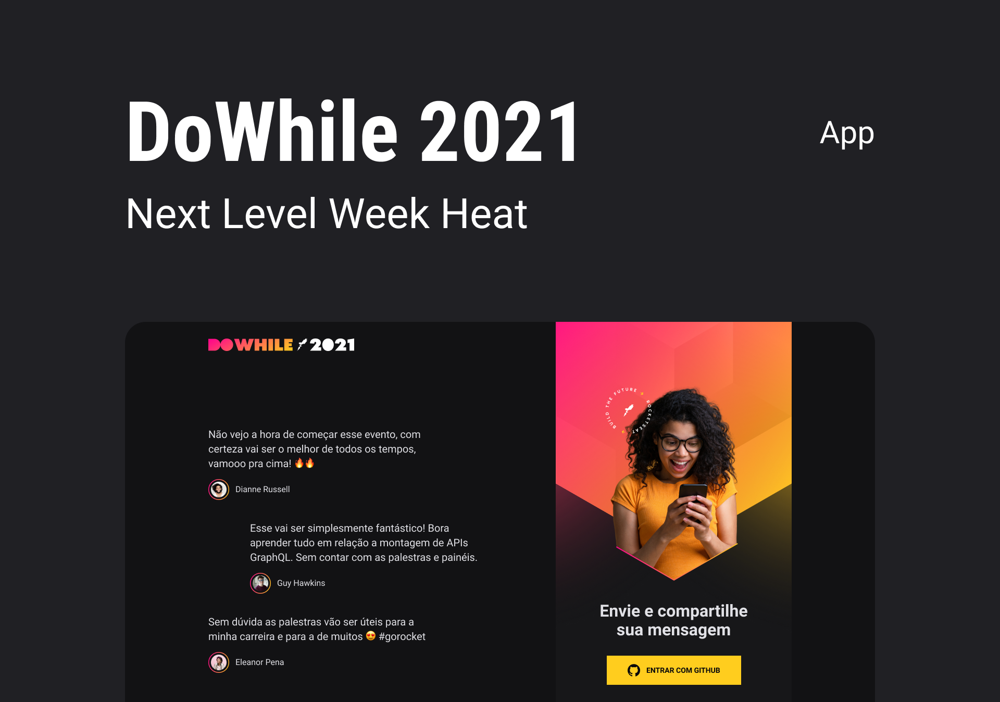
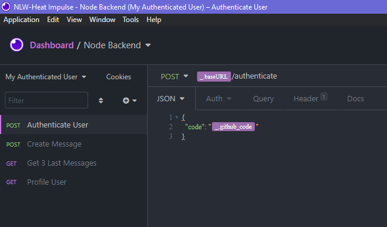

# NLW-Heat - Impulse Track - Node Backend

NLW-Heat backend project with Github OAuth, JWT and Prisma

## Planned Design

<p align="center"></p>

Based on [Rocketseat's NLW-Heat design](https://www.figma.com/community/file/1031699316177416916). You might need a [Figma](https://figma.com) account to access the design.

## Tecnologies

- NodeJS
- Typescript
- Prisma
- JWT
- Websockets
- Insomnia.REST

## Instructions for clonning and running this project

Execute the following commands to get the project up and running:

```bash
git clone https://github.com/jobsonita/rocketseat-nlw-heat-impulse-node.git

# wait for git to finish clonning the project, then navigate to the folder and install the dependencies:

cd rocketseat-nlw-heat-impulse-node

yarn
```

After this is done, create a copy of the file `.env.example` (or just rename it) as `.env` and fill it properly. For this, you'll need to visit https://github.com/settings/developers, create a new OAuth App and generate a new client secret for that app.

Then, run the migrations:

```bash
yarn prisma migrate dev
```

You can check your database contents at any moment by running the following command and opening http://localhost:5555 on your browser:

```bash
yarn prisma studio
```

Finally, run the server:

```bash
yarn dev
```

Accessing http://localhost:4000/github will redirect you to github's OAuth page, which then redirects the user to a stub sign-in page (this will later be handled by the frontend apps). Copy the code returned by this page to be used with Insomnia app.

Open Insomnia, import the [Insomnia requests file](tools/Insomnia_Requests_2021-10-21.json) and configure the environment with your oauth code. Execute the available requests to authenticate into the app, post new messages, retrieve the last 3 messages and retrieve your github profile info.

<p align="center"></p>
